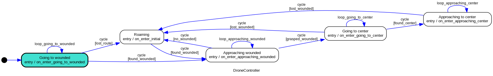

# Overview of drone

## How to run

### Install dependencies

```bash
pip install -r requirements.txt
```

### Building the pathfinder:

Execute the builder.py file.

```bash
python builder.py
```	

## Frontier Drone

The Frontier Drone is composed of different main modules responsible for different tasks. The main modules are:

- **Drone Controller**: responsible for controlling the drone and defining the commands to the drone.
- **Mapper**: responsible for mapping the environment from the lidar data.
- **Roamer**: responsible for exploring the environment.

## Drone Controller

The drone controller is a finite state machine that controls the drone. The states are:



When in "Roaming", the drone will follow the commands given by the Roamer.

## Mapper

Every frame, the Mapper will receive the lidar data and will update the map. There are two main maps:

- **Occupancy Grid Map**: a 2D map that represents the environment. Each cell of the map has a value between 0 and 1, where 0 means that the cell is free and 1 means that the cell is occupied. 
- **Confidence Map**: a 2D map that represents the confidence of the occupancy grid map. Each cell of the map has a value between 0 and 1, where 0 means that the cell is not confident and 1 means that the cell is confident.

The Mapper can also receive the mapping data of other drones and merge it with its own maps.

## Roamer

The Roamer is responsible for exploring the environment. It will receive the occupancy grid map from the Mapper and will generate commands to the drone. The Roamer is also a finite state machine and is based on the frontier exploration algorithm.